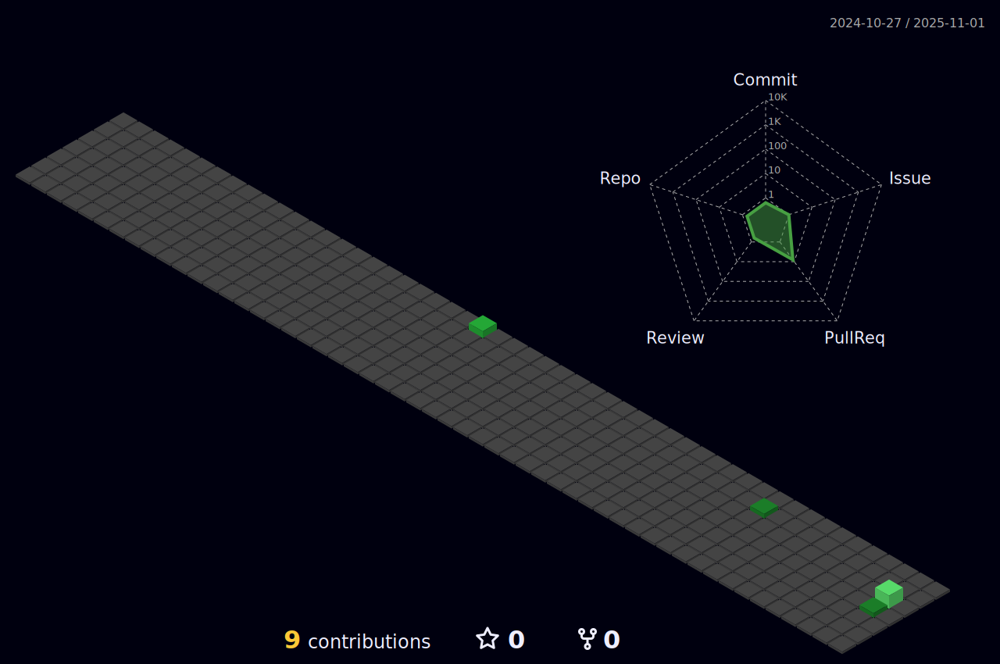

####

<picture>
  
</picture>

###

### My Skills

###

  
  
  
  
  
  
  
  
  
  
  
  
  
  
  
  
  
  
  
  
  
  
  
  
  
  
  
  
  
  
  
  
  
  
  
  
  
  
  
  
  
  
  
  
  
  
  
  
  
  
  
  
  
  
  
  
  
  
  
  
  
  
  
  
  
  
  
  
  
  
  
  
  

###

### Connect With Me

###

  
  

###

### Stats

###

  
    

#### Popular Projects

<a href="https://github.com/alhumsiabdo/">
  <!-- Change the `github-readme-stats.anuraghazra1.vercel.app` to `github-readme-stats.vercel.app`  -->
  
</a>    
<a href="https://github.com/alhumsiabdo/">
  <!-- Change the `github-readme-stats.anuraghazra1.vercel.app` to `github-readme-stats.vercel.app`  -->
  
</a>

#### Trophies

 

###
#### Profile Visitor

